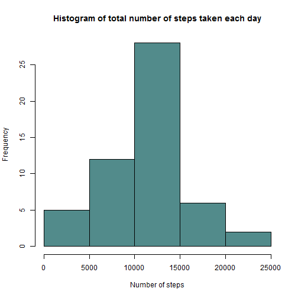

# Reproducible Research: Peer Assessment 1


## Loading and preprocessing the data
In this section, I'll present the steps taken to load & pre-process the activity dataset that was provided by the instructor.


```r
setwd("C:/Users/Shadi/datasciencecoursera/Reproducible Research")
options(scipen = 1, digits = 7)
activity.data <- read.csv("activity.csv", 
                          colClasses=c("numeric", "Date", "numeric"), 
                          na.strings="NA")
```

The read.csv function loads the activity dataset, and the colClasses and na.strings arguments allow us to specify the classes of the different columns and the strings that represent NA values, respectively.

After reading the activity dataset, the next step is to remove NA values. This can be done by simply invoking the complete.cases function, as shown below:


```r
procData <- activity.data[complete.cases(activity.data),]
```

The processed dataset will be used for the next 2 sections. Then in section 4, we'll use the original dataset and impute the missing values. 

## What is mean total number of steps taken per day?

First, we generate a histogram that shows the total number of steps taken each day:


```r
sumSteps <- tapply(procData$steps, procData$date, sum)
hist(sumSteps, main="Histogram of total number of steps taken each day", 
     xlab="Number of steps", col="#528B8B")
```

 

Then we calculate the mean and median of the total number of steps taken each day:


```r
mean(sumSteps)
```

```
## [1] 10766.19
```

```r
median(sumSteps)
```

```
## [1] 10765
```

## What is the average daily activity pattern?

First, we generate a time series plot that shows the interval (x-axis) against the average number of steps (averaged across all days):


```r
avgSteps <- aggregate(procData$steps, list(procData$interval), mean)
colnames(avgSteps) <- c("Interval", "AvgSteps")
plot(avgSteps$Interval, avgSteps$AvgSteps, type="l", 
     main="Time series plot of interval vs average number of steps", 
     xlab="Interval", ylab="Average number of steps", col="#53868B")
```

 

Then we find which interval, on average, contains the maximum number of steps:


```r
avgSteps[avgSteps$AvgSteps == max(avgSteps$AvgSteps), 1]
```

```
## [1] 835
```

Therefore, the interval that contains the maximum number of steps is: 835.

## Imputing missing values

First, we find the number of missing values in the original dataset (activity.data):


```r
sum(is.na(activity.data))
```

```
## [1] 2304
```

Second, my strategy for replacing missing values (i.e. NA values) is to replace the missing value with the mean for that interval, averaged across all days. However, to make the data consistent, I didn't use the raw mean. I rounded the mean to make the number of steps a whole number. 

The implementation of this strategy is shown below: 


```r
for (i in seq(1:nrow(activity.data))){
  if(is.na(activity.data$steps[i])){
    activity.data$steps[i] <- round(
                        avgSteps[avgSteps$Interval==activity.data$interval[i],2], 
                        digits = 0)
  }
}
```

Then, we generate a histogram that shows the total number of steps taken each day in the new and updated dataset:


```r
sumSteps <- tapply(activity.data$steps, activity.data$date, sum)
hist(sumSteps, main="Histogram of total number of steps taken each day", 
     xlab="Number of steps", col="#528B8B")
```

 

Then we calculate the mean and median of the total number of steps taken each day in the new and updated dataset:


```r
mean(sumSteps)
```

```
## [1] 10765.64
```

```r
median(sumSteps)
```

```
## [1] 10762
```

As shown in the results above, replacing NA values with the mean for that specific interval does change the results slightly. In the histogram, for isntance, the frequency of days where the test subject took between 10,000 and 15,000 steps increased markedly. This isn't surprising, since the number of records with missing values exceeded 2,000 and if those missing values would be replaced, it'll surely some effect on the results. 

The mean of the total number of steps taken per day didn't change considerably (only a differenced of 0.55 steps). A similar thing can be observed for the median (only a difference of 3 steps).

Therefore, imputing missing data in this case did have some impact on the estimates of total daily number of steps, but it's not that big of a difference.

## Are there differences in activity patterns between weekdays and weekends?

First of all, we create a factor variable (DayType), indicating whether a given date is a weekday or a weekend and add it to the activity.data data frame:


```r
day.type <- sapply(weekdays(activity.data$date), function(x){
  if (x %in% c("Saturday", "Sunday")){
    x <- "weekend"
  }
  else{
    x <- "weekday"
  }
})
day.factor <- factor(day.type)
activity.data$DayType <- day.factor
```

After that, in order to do 2 separate plots for weekdays and weekends, we create 2 subsets of the data as follows: 


```r
weekday.data <- activity.data[activity.data$DayType == "weekday",]
weekend.data <- activity.data[activity.data$DayType == "weekend",]
```

Then, to generate the 2 plots for weekday and weekend data side by side, we do the following: 


```r
weekdays.avgSteps <- aggregate(weekday.data$steps, 
                              list(weekday.data$interval), mean)
colnames(weekdays.avgSteps) <- c("Interval", "AvgSteps")

weekends.avgSteps <- aggregate(weekend.data$steps, 
                              list(weekend.data$interval), mean)
colnames(weekends.avgSteps) <- c("Interval", "AvgSteps")

par(mfrow = c(2, 1))
plot(weekdays.avgSteps$Interval, weekdays.avgSteps$AvgSteps, type="l", 
     main="Weekdays", xlab="Interval", 
     ylab="Average number of steps", col="#53868B")

plot(weekends.avgSteps$Interval, weekends.avgSteps$AvgSteps, type="l", 
     main="Weekends", xlab="Interval", 
     ylab="Average number of steps", col="#53868B")
```

 

It appears from a preliminary reading of the plots that weekends show a more varied pattern of activity compared to weekdays. 
